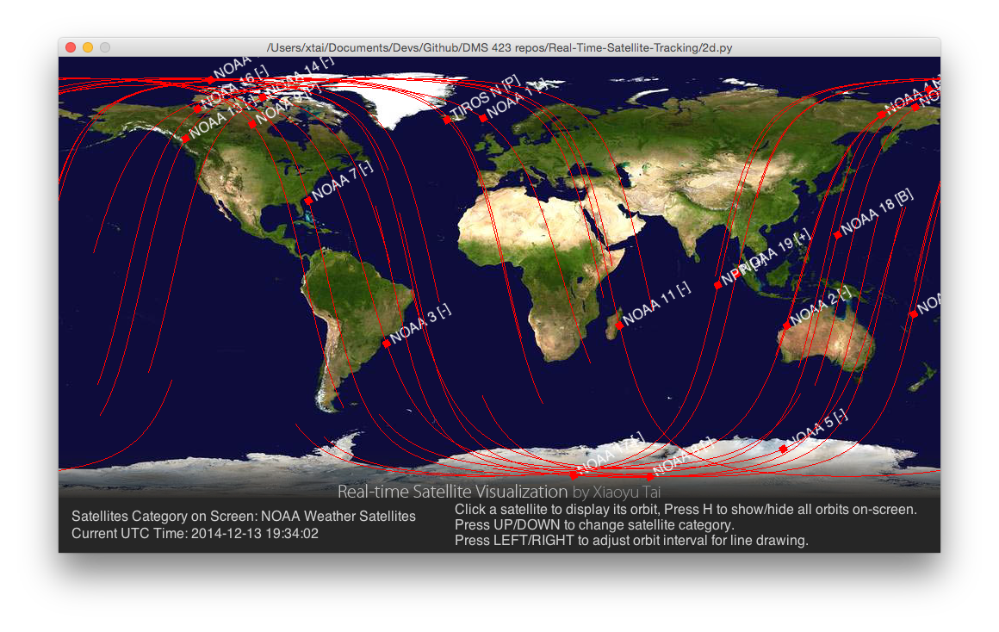
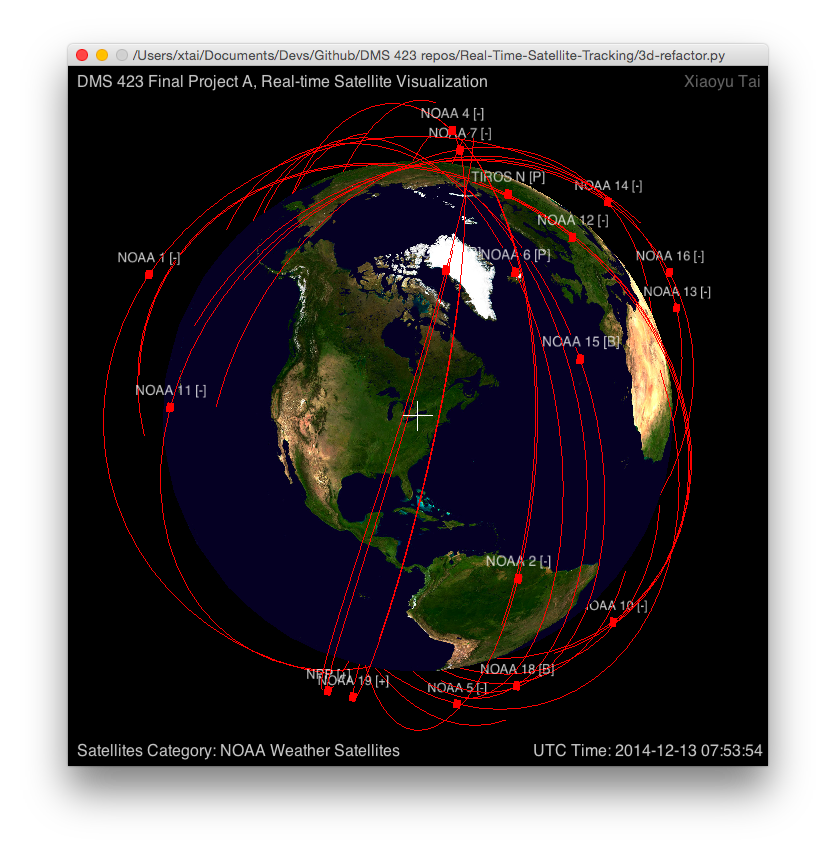
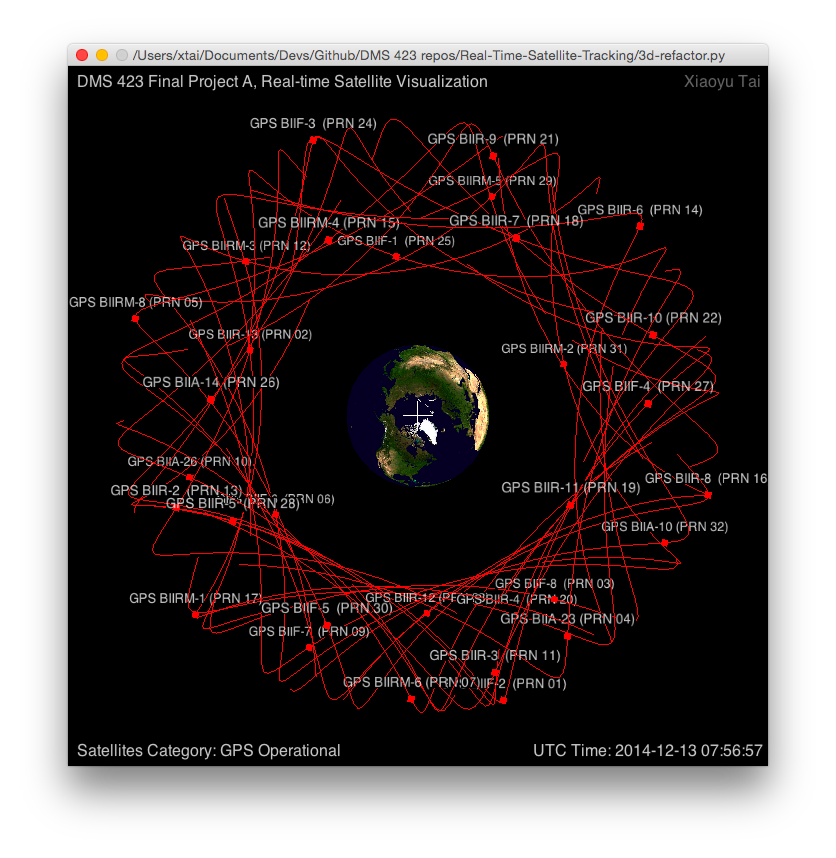
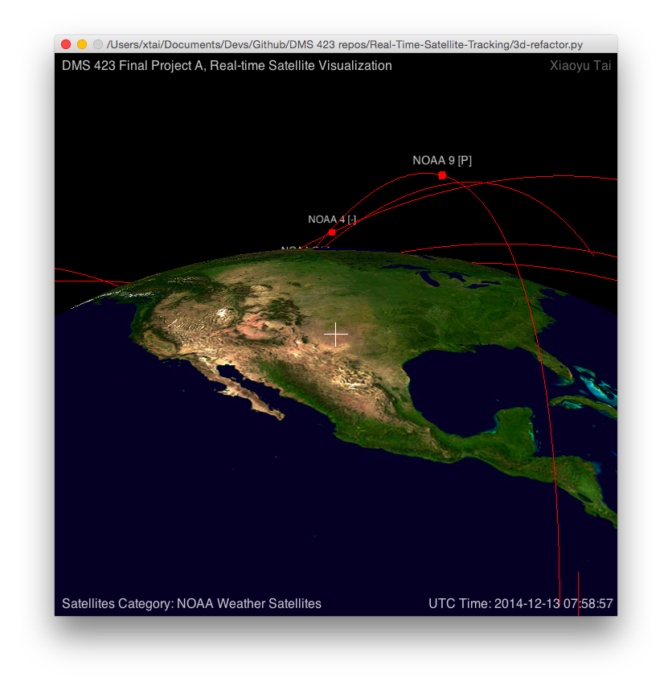
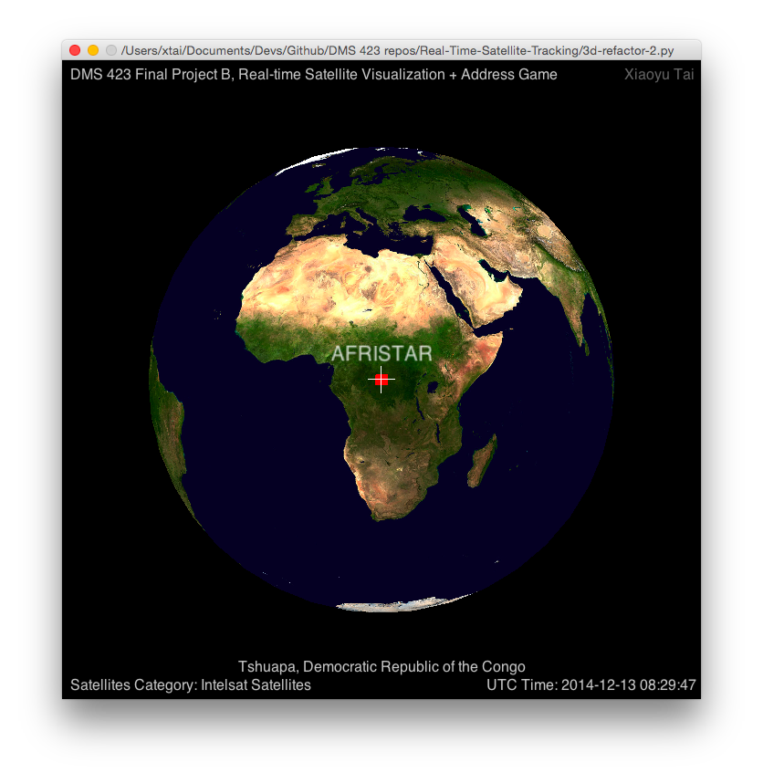

Real-Time-Satellite-Tracking
============================

Tracking satellites in real time form TLS data.  

Using Python + [pyglet](http://www.pyglet.org) OpenGL library + [PyEphem](http://rhodesmill.org/pyephem/) library

## Input

Data type: TLS (Two-line element set)  
Can be found at [www.celestrak.com](http://www.celestrak.com/NORAD/elements/)

## 2D version

### file: [`2d.py`](2d.py)

How to control:  

- Click a satellite to display its orbit.
- Press H to show/hide all orbits on-screen.
- Press UP/DOWN to change satellite category.
- Press LEFT/RIGHT to adjust orbit interval for line drawing.

## 3D version

### file: [`3d.py`](3d.py) 

Current Control:  

- Press Z/X to zoom in or out.
- Press arrow keys to rotate the global.

### file: [`3d-refactor.py`](3d-refactor.py)

Control:

1. Use arrow keys/drag mouse to move the globe
2. Use A/W/S/D to rotate the globe in different ways
3. Reset the view point by click Q(x-axis rotation), E(z-axis rotation), N(all rotation and back to UB)
4. Use Z/X to zoom in and out
5. Use G/H to show/hide the satellites's trace lines
6. Use number key 1-7 to select satellite sets

### file: [`3d-refactor-2.py`](3d-refactor-2.py)

Control:

All control methods from [`3d-refactor.py`](3d-refactor.py), plus:

7. Use R to randomly select a satellite on-screen and output the address below it
8. Use E to randomly give a point on earth and output its real-world address
9. Move the globe and press T for the address of the current point (center of the cross)

## Sample Data

Satellites Category | File Name (inside [`/data/`](data/) )
------------ | ------------- 
Space Stations | stations.txt
NOAA Weather Satellites | noaa.txt
GPS Operational | gps-ops.txt
Intelsat Satellites | intelsat.txt
Science Satellites | science.txt
Miscellaneous Military | military.txt
Last 30 Days' Launches | tle-new.txt

## Screen Shots

## License

MIT
